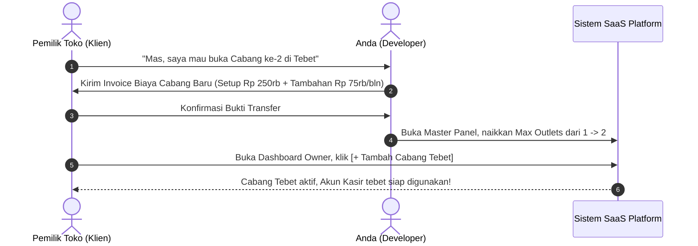

# 🏢 Blueprint & Rancangan Arsitektur: Multi-Tenant SaaS Platform Toko & Multi-Cabang

Dokumen ini merangkum rancangan teknis, skema database, hierarki hak akses (roles), model bisnis, dan alur operasional untuk platform **SaaS (Software-as-a-Service) POS, Antrian & AI Assistant Multi-Cabang** untuk UMKM dan Bisnis Ritel.

---

## 1. 👑 Hierarki Peran & Hak Akses (Role Hierarchy)

Sistem dibagi menjadi 4 level pengguna dengan hak akses yang terisolasi:

```
┌─────────────────────────────────────────────────────────────┐
│ 1. DEVELOPER / SUPER ADMIN (Platform Owner - ANDA)          │
│    - Mengelola semua Client/Tenant & kuota cabang           │
│    - Memantau tagihan bulanan (MRR) & status aktif/suspend   │
│    - Monitoring server, database, & penggunaan token AI     │
└──────────────────────────────┬──────────────────────────────┘
                               │
┌──────────────────────────────▼──────────────────────────────┐
│ 2. TENANT OWNER (Pemilik Bisnis Klien, misal: Pak Budi)     │
│    - Mengelola master katalog produk, harga & diskon        │
│    - Memantau omset gabungan dari SEMUA cabang miliknya     │
│    - Mengatur data cabang (outlet) & membuat akun kasir     │
└──────────────────────────────┬──────────────────────────────┘
                               │
┌──────────────────────────────▼──────────────────────────────┐
│ 3. OUTLET CASHIER / STAFF (Kasir di Cabang Tertentu)        │
│    - Hanya bisa melihat & memproses antrian di cabangnya    │
│    - Menyesuaikan sisa stok fisik di cabangnya saja         │
│    - TIDAK BISA melihat data keuangan cabang lain / owner   │
└──────────────────────────────┬──────────────────────────────┘
                               │
┌──────────────────────────────▼──────────────────────────────┐
│ 4. END CUSTOMER (Pembeli / Pelanggan)                       │
│    - Memilih cabang terdekat saat membuka website           │
│    - Bertanya ketersediaan stok & bahan ke AI Assistant RAG │
│    - Checkout pesanan & mendapatkan nomor antrian harian    │
└─────────────────────────────────────────────────────────────┘
```

---

## 2. 🗄️ Rancangan Skema Database (PostgreSQL Multi-Tenant)

### A. Tabel Master Tenant & Langganan (Level Super Admin)

```sql
-- 1. Tabel Klien / Bisnis Penyewa (Tenants)
CREATE TABLE tenants (
    id UUID PRIMARY KEY DEFAULT uuid_generate_v4(),
    nama_bisnis VARCHAR(150) NOT NULL, -- Contoh: "Kopi Budi Nusantara"
    slug VARCHAR(100) UNIQUE NOT NULL, -- Contoh: "kopibudi" (untuk subdomain/URL)
    custom_domain VARCHAR(150) UNIQUE, -- Contoh: "kopibudi.my.id"
    owner_name VARCHAR(100) NOT NULL,
    owner_phone VARCHAR(20) NOT NULL,
    status VARCHAR(20) NOT NULL DEFAULT 'active' CHECK (status IN ('active', 'suspended', 'trial')),
    max_outlets INTEGER NOT NULL DEFAULT 1, -- Kuota maksimal cabang yang dibayar
    created_at TIMESTAMP DEFAULT CURRENT_TIMESTAMP,
    updated_at TIMESTAMP DEFAULT CURRENT_TIMESTAMP
);

-- 2. Tabel Status Tagihan & Langganan (Subscriptions)
CREATE TABLE subscriptions (
    id UUID PRIMARY KEY DEFAULT uuid_generate_v4(),
    tenant_id UUID REFERENCES tenants(id) ON DELETE CASCADE,
    plan_tier VARCHAR(50) NOT NULL DEFAULT 'basic', -- 'basic', 'pro', 'enterprise'
    monthly_fee INTEGER NOT NULL, -- Misal: 99000, 249000
    billing_date DATE NOT NULL, -- Tanggal jatuh tempo tagihan tiap bulan
    payment_status VARCHAR(20) NOT NULL DEFAULT 'paid' CHECK (payment_status IN ('paid', 'unpaid', 'overdue')),
    last_payment_date TIMESTAMP,
    created_at TIMESTAMP DEFAULT CURRENT_TIMESTAMP
);
```

---

### B. Tabel Cabang, Pengguna, & Inventaris (Level Tenant)

```sql
-- 3. Tabel Cabang Toko (Outlets)
CREATE TABLE outlets (
    id UUID PRIMARY KEY DEFAULT uuid_generate_v4(),
    tenant_id UUID REFERENCES tenants(id) ON DELETE CASCADE,
    nama_cabang VARCHAR(100) NOT NULL, -- Contoh: "Cabang Tebet", "Cabang Kemang"
    alamat TEXT NOT NULL,
    telepon VARCHAR(20),
    is_active BOOLEAN DEFAULT TRUE,
    created_at TIMESTAMP DEFAULT CURRENT_TIMESTAMP
);

-- 4. Tabel Pengguna (Auth & RBAC Terisolasi)
CREATE TABLE auth (
    id UUID PRIMARY KEY DEFAULT uuid_generate_v4(),
    tenant_id UUID REFERENCES tenants(id) ON DELETE CASCADE,
    outlet_id UUID REFERENCES outlets(id) ON DELETE SET NULL, -- NULL jika role = 'owner' / 'superadmin'
    username VARCHAR(100) NOT NULL,
    password TEXT NOT NULL,
    role VARCHAR(20) NOT NULL CHECK (role IN ('superadmin', 'owner', 'kasir', 'user')),
    created_at TIMESTAMP DEFAULT CURRENT_TIMESTAMP,
    CONSTRAINT unique_tenant_username UNIQUE (tenant_id, username)
);

-- 5. Tabel Produk Terisolasi per Tenant & Outlet
CREATE TABLE produk (
    id UUID PRIMARY KEY DEFAULT uuid_generate_v4(),
    tenant_id UUID REFERENCES tenants(id) ON DELETE CASCADE,
    outlet_id UUID REFERENCES outlets(id) ON DELETE CASCADE,
    nama VARCHAR(255) NOT NULL,
    harga INTEGER NOT NULL,
    stock INTEGER NOT NULL DEFAULT 0,
    status BOOLEAN DEFAULT TRUE,
    image TEXT,
    kategori VARCHAR(100) DEFAULT 'Umum',
    deskripsi TEXT,
    ingredients TEXT,
    deleted_at TIMESTAMP NULL,
    created_at TIMESTAMP DEFAULT CURRENT_TIMESTAMP,
    updated_at TIMESTAMP DEFAULT CURRENT_TIMESTAMP
);

-- 6. Tabel Pesanan & Antrian Harian (Per Cabang)
CREATE TABLE orders (
    id UUID PRIMARY KEY DEFAULT uuid_generate_v4(),
    tenant_id UUID REFERENCES tenants(id) ON DELETE CASCADE,
    outlet_id UUID REFERENCES outlets(id) ON DELETE CASCADE,
    auth_id UUID REFERENCES auth(id) ON DELETE SET NULL,
    customer_name VARCHAR(100) NOT NULL,
    customer_phone VARCHAR(20),
    total_price INTEGER NOT NULL,
    status_pesanan VARCHAR(20) NOT NULL DEFAULT 'ANTRI' CHECK (
        status_pesanan IN ('ANTRI', 'DIPROSES', 'SELESAI', 'DIBATALKAN')
    ),
    created_at TIMESTAMP DEFAULT CURRENT_TIMESTAMP
);

CREATE TABLE daily_queue (
    id UUID PRIMARY KEY DEFAULT uuid_generate_v4(),
    tenant_id UUID REFERENCES tenants(id) ON DELETE CASCADE,
    outlet_id UUID REFERENCES outlets(id) ON DELETE CASCADE,
    order_id UUID REFERENCES orders(id) ON DELETE CASCADE,
    queue_number INTEGER NOT NULL,
    queue_date DATE NOT NULL
);
```

---

## 3. 🖥️ Rancangan Antarmuka & Modul Aplikasi (UI/UX)

### A. 🛡️ Modul 1: Super Admin / Developer Control Panel (`/superadmin`)
* **Halaman Master Klien:** Daftar seluruh bisnis penyewa, jumlah cabang aktif, dan status langganan.
* **Manajemen Kuota Cabang:** Tombol *slider* untuk menambah kuota cabang (`max_outlets` = 1 ➔ 2 ➔ 5).
* **Saklar Sakti (*Suspend Switch*):** 1 klik untuk mem-pause toko klien jika menunggak bayar tagihan.
* **Monitoring Penggunaan AI:** Pantau jumlah request chat Gemini per tenant per hari.

### B. 🏢 Modul 2: Tenant Owner Dashboard (`/admin/dashboard`)
* **Outlet Switcher Dropdown:** Filter data berdasarkan *"Semua Cabang"* atau *"Cabang Spesifik"*.
* **Manajemen Cabang (`/admin/outlets`):** Form tambah cabang baru (otomatis terkunci jika melebihi kuota paket).
* **Master Menu & Resep:** Input produk master sekali, lalu bisa diduplikasi ke semua cabang.
* **Laporan Keuangan & Penjualan:** Grafik omset harian, produk terlaris per cabang, dan export Excel.

### C. 📟 Modul 3: Layar Kasir & Antrian Outlet (`/kasir/antrian`)
* Tampilan responsif dioptimalkan untuk tablet kasir & monitor dapur.
* Notifikasi suara / visual saat ada pesanan online baru masuk.
* Tombol cepat ubah status: `Terima & Proses` ➔ `Selesai & Panggil No. Antrian`.

### D. 📱 Modul 4: Toko Pembeli & AI Assistant (`/` atau `kopibudi.my.id`)
* **Location Picker:** Pembeli memilih cabang terdekat.
* **Production RAG Widget:** AI menjawab pertanyaan stok live di cabang tersebut, rekomendasi menu, dan komposisi/alergen secara real-time via Server-Sent Events (SSE).
* **Tracking Nomor Antrian Live:** Pembeli memantau nomor antriannya langsung dari HP tanpa perlu berdiri di depan kasir.

---

## 4. 💰 Model Bisnis & Skema Paket Tarif (Pricing Matrix)

| Komponen Paket | 📦 Paket Basic (1 Cabang) | 🚀 Paket Pro (Hingga 3 Cabang) | 🏢 Paket Enterprise (Custom / >5 Cabang) |
| :--- | :--- | :--- | :--- |
| **Target Klien** | Kafe kecil, Barbershop, Warung | Restoran ramai, Petshop, Klinik | Jaringan Franchise, Toko Bangunan |
| **Biaya Setup Awal** | Rp 500.000 – Rp 750.000 | Rp 1.500.000 – Rp 2.500.000 | Rp 5.000.000 – Rp 15.000.000 |
| **Biaya Sewa Bulanan** | **Rp 99.000 – Rp 149.000 / bln** | **Rp 350.000 – Rp 650.000 / bln** | **Rp 1.500.000 – Rp 4.000.000 / bln** |
| **Tambah Cabang Ekstra** | + Rp 75.000 / bln per cabang | + Rp 50.000 / bln per cabang | Termasuk dalam kuota khusus |
| **Fitur Unggulan** | Katalog + Antrian + AI RAG | Multi-Cabang + WhatsApp Notif + Struk | Dedicated Server + Custom ERP Integration |

---

## 5. 🔄 SOP Alur Penambahan Cabang Baru (Step-by-Step)



---

## 6. 🚀 Roadmap Eksekusi 90 Hari

* **Bulan 1 (MVP & Pilot Project):** Selesaikan 1 sistem live untuk 1 kafe / UMKM lokal pertama sebagai studi kasus bukti nyata.
* **Bulan 2 (Multi-Tenant & Master Panel):** Pasang tabel `tenants` & `outlets` serta bangun halaman Super Admin untuk mengelola banyak toko sekaligus.
* **Bulan 3 (Scale to 10+ Klien):** Lakukan *direct outreach* ke 30 bisnis di Google Maps & LinkedIn. Targetkan 10 klien aktif untuk menghasilkan arus kas pasif Rp 1.500.000 – Rp 3.500.000 / bulan.
